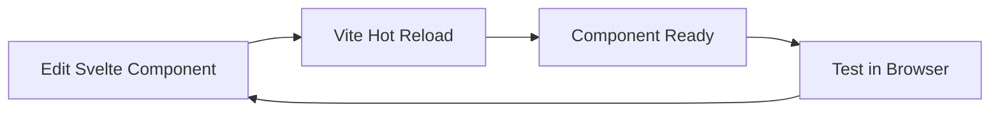
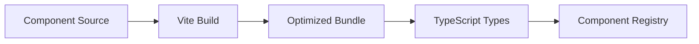
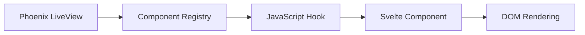

# Svelte Component Build Pipeline Documentation

## Overview

This document describes the complete build pipeline for Svelte components in the More MUD project, from development to production deployment. The system uses a hybrid approach combining Phoenix LiveView with Svelte Islands for dynamic, interactive components.

## Architecture Overview

```
┌─────────────────┐    ┌──────────────────┐    ┌─────────────────┐
│   Phoenix       │    │   Svelte         │    │   JavaScript    │
│   LiveView      │◄──►│   Components     │◄──►│   Hooks        │
│   (Server)      │    │   (Client)       │    │   (Bridge)     │
└─────────────────┘    └──────────────────┘    └─────────────────┘
         │                       │                       │
         │                       │                       │
         ▼                       ▼                       ▼
┌─────────────────┐    ┌──────────────────┐    ┌─────────────────┐
│   Component     │    │   Vite Build     │    │   Asset         │
│   Registry      │    │   System         │    │   Pipeline      │
│   (GenServer)   │    │   (Svelte 5)     │    │   (esbuild)     │
└─────────────────┘    └──────────────────┘    └─────────────────┘
```

## Directory Structure

```
assets/
├── js/                          # JavaScript entry points
│   ├── app.js                  # Main Phoenix app (esbuild entry)
│   ├── svelte_island_hook.js   # Svelte component hook
│   └── mud_surface_hook.js     # MUD surface management hook
├── css/                        # Stylesheets
│   └── app.css                 # Main CSS (Tailwind entry)
└── svelte/                     # Svelte component source
    ├── components/             # Individual Svelte components
    │   ├── world-scene/        # 3D world rendering
    │   ├── world-chat/         # Global chat
    │   ├── local-chat/         # Local area chat
    │   ├── system-chat/        # System messages
    │   ├── player-status/      # Player stats
    │   └── command-input/      # Command entry
    ├── src/                    # TypeScript types and exports
    ├── package.json            # Node.js dependencies
    ├── vite.config.js          # Vite configuration
    ├── tsconfig.json           # TypeScript configuration
    └── build-component.js      # Individual component builder
```

## Build Pipeline Components

### 1. Phoenix Asset Pipeline (esbuild)

**Configuration**: `config/config.exs`
```elixir
config :esbuild,
  version: "0.25.4",
  more: [
    args: ~w(js/app.js --bundle --target=es2022 --outdir=../priv/static/assets/js --external:/fonts/* --external:/images/* --alias:@=.),
    cd: Path.expand("../assets", __DIR__),
    env: %{"NODE_PATH" => [Path.expand("../deps", __DIR__), Mix.Project.build_path()]}
  ]
```

**Entry Point**: `assets/js/app.js`
- Bundles all JavaScript hooks and dependencies
- Outputs to `priv/static/assets/js/`
- Handles LiveView initialization and hook registration

**Build Command**: `mix assets.deploy` or automatic via `mix phx.server`

### 2. Svelte Component Build System (Vite)

**Configuration**: `assets/svelte/vite.config.js`
```javascript
export default defineConfig({
  plugins: [
    svelte({
      compilerOptions: {
        runes: true  // Svelte 5 runes support
      }
    })
  ],
  build: {
    lib: {
      entry: './src/main.ts',
      name: 'MoreSvelteComponents',
      fileName: 'more-svelte'
    }
  }
})
```

**Entry Point**: `assets/svelte/src/main.ts`
- Exports all Svelte components
- Provides TypeScript types
- Enables tree-shaking and optimization

**Build Commands**:
```bash
# Build all components
npm run build

# Build individual component
npm run build:world-scene
npm run build:world-chat
npm run build:local-chat
npm run build:system-chat
npm run build:player-status
npm run build:command-input

# Build specific component
node build-component.js world-scene
```

### 3. Individual Component Builder

**Script**: `assets/svelte/build-component.js`
- Builds single components without full Vite config
- Creates isolated bundles for each component
- Outputs to `assets/svelte/dist/{component-name}/`

**Usage**:
```bash
cd assets/svelte
node build-component.js world-scene
```

## Component Lifecycle

### 1. Development Phase



**Steps**:
1. Edit component in `assets/svelte/components/{name}/`
2. Vite automatically rebuilds on file changes
3. Component available for testing in Phoenix LiveView

### 2. Build Phase



**Steps**:
1. Run `npm run build:{component-name}`
2. Vite compiles Svelte 5 + TypeScript
3. Outputs optimized JavaScript bundle
4. Generates TypeScript declarations
5. Component registered in Phoenix registry

### 3. Runtime Phase



**Steps**:
1. LiveView requests component from registry
2. JavaScript hook loads component bundle
3. Svelte component initializes
4. Component renders to DOM
5. LiveView manages component lifecycle

## Hook System

### 1. SvelteIsland Hook

**File**: `assets/js/svelte_island_hook.js`
- Manages Svelte component lifecycle
- Handles component mounting/unmounting
- Manages component props and state

**Registration**: 
```javascript
// In app.js
hooks: {
  SvelteIsland: window.SvelteIsland
}
```

### 2. MudSurfaceComponent Hook

**File**: `assets/js/mud_surface_hook.js`
- Manages component positioning and sizing
- Handles drag & drop functionality
- Manages component controls (minimize, maximize, close)

**Registration**:
```javascript
// In app.js
hooks: {
  MudSurfaceComponent: window.MudSurfaceComponent
}
```

## Component Registry (Elixir)

**File**: `lib/more_web/svelte_component_registry.ex`
- GenServer managing component state
- Tracks component availability and build status
- Manages component lifecycle and updates

**Key Functions**:
```elixir
# List available components
MoreWeb.SvelteComponentRegistry.list_components()

# Get specific component
MoreWeb.SvelteComponentRegistry.get_component("world-scene")

# Trigger component build
MoreWeb.SvelteComponentRegistry.trigger_build("world-scene")
```

## LiveView Integration

**File**: `lib/more_web/live/svelte_playground_live.ex`
- Manages component instances
- Handles component positioning and state
- Coordinates with JavaScript hooks

**Key Events**:
```elixir
# Add component
handle_event("add_component", %{"component" => component_type}, socket)

# Update position
handle_event("update_component_position", %{"id" => id, "position" => pos}, socket)

# Update size
handle_event("update_component_size", %{"id" => id, "size" => size}, socket)
```

## Debugging Guide

### 1. Asset Pipeline Issues

**Problem**: `app.js` not found
**Solution**: Check esbuild configuration and run `mix assets.deploy`

**Problem**: Hooks not loading
**Solution**: Verify hook registration in `app.js` and import statements

**Problem**: Components not building
**Solution**: Check Vite configuration and run `npm run build`

### 2. Component Loading Issues

**Problem**: Component not appearing
**Solution**: Check component registry and LiveView assigns

**Problem**: Component not interactive
**Solution**: Verify JavaScript hook is properly attached

**Problem**: Component positioning wrong
**Solution**: Check CSS positioning and JavaScript coordinate handling

### 3. Build System Issues

**Problem**: Vite build failing
**Solution**: Check Svelte 5 compatibility and TypeScript errors

**Problem**: esbuild not bundling
**Solution**: Verify entry point and output directory configuration

**Problem**: Hot reload not working
**Solution**: Check file watchers and development configuration

## Development Workflow

### 1. Adding New Components

```bash
# 1. Create component directory
mkdir assets/svelte/components/new-component

# 2. Create component files
touch assets/svelte/components/new-component/index.svelte
touch assets/svelte/components/new-component/index.ts

# 3. Add to main exports
echo "export { default as NewComponent } from './components/new-component';" >> assets/svelte/src/main.ts

# 4. Build component
cd assets/svelte
npm run build:new-component

# 5. Add to registry
# Edit lib/more_web/svelte_component_registry.ex

# 6. Add to LiveView
# Edit lib/more_web/live/svelte_playground_live.ex
```

### 2. Testing Components

```bash
# 1. Start Phoenix server
mix phx.server

# 2. Open browser
open http://localhost:4000

# 3. Add component via UI
# Click "Add [Component]" button

# 4. Test functionality
# Drag, resize, interact with component

# 5. Check console for errors
# Open browser developer tools
```

### 3. Debugging Components

```javascript
// In browser console
// Check if hooks are registered
console.log('Hooks:', window.LiveSocket.hooks);

// Check component state
console.log('Component:', document.querySelector('[data-component-type]'));

// Test hook methods
const component = document.querySelector('.mud-component');
console.log('Hook:', component.__mudHook);
```

## Production Deployment

### 1. Build Assets

```bash
# Build Phoenix assets
mix assets.deploy

# Build Svelte components
cd assets/svelte
npm run build:all
```

### 2. Asset Optimization

- JavaScript minification via esbuild
- CSS optimization via Tailwind
- Component bundling via Vite
- TypeScript compilation and type checking

### 3. Deployment Checklist

- [ ] All components built successfully
- [ ] Asset pipeline working
- [ ] Hooks properly registered
- [ ] Component registry populated
- [ ] LiveView events working
- [ ] No console errors
- [ ] Components responsive and interactive

## Troubleshooting Common Issues

### 1. "app.js not found" Error

**Cause**: Asset pipeline not building or wrong path
**Solution**:
```bash
# Clean and rebuild
mix clean
mix assets.deploy

# Check output directory
ls -la priv/static/assets/js/

# Verify esbuild config
cat config/config.exs | grep esbuild
```

### 2. "Hook not found" Error

**Cause**: Hook not properly imported or registered
**Solution**:
```bash
# Check hook files exist
ls -la assets/js/*hook.js

# Verify imports in app.js
cat assets/js/app.js

# Check browser console for errors
```

### 3. "Component not loading" Error

**Cause**: Component not built or registry issue
**Solution**:
```bash
# Check component build
cd assets/svelte
npm run build:world-scene

# Check registry
iex -S mix
iex> MoreWeb.SvelteComponentRegistry.list_components()

# Check LiveView assigns
# Look at browser network tab
```

### 4. "TypeScript compilation failed" Error

**Cause**: Svelte 5 compatibility or type issues
**Solution**:
```bash
# Check Svelte version
cd assets/svelte
npm list svelte

# Check TypeScript config
cat tsconfig.json

# Run type check
npm run type-check
```

## Performance Considerations

### 1. Component Lazy Loading

- Components built individually for selective loading
- Vite enables tree-shaking for unused code elimination
- Phoenix LiveView manages component lifecycle efficiently

### 2. Asset Optimization

- esbuild provides fast JavaScript bundling
- Tailwind CSS purges unused styles
- Component bundles are optimized and minified

### 3. Runtime Performance

- Hooks use efficient event delegation
- Component state managed in LiveView for consistency
- Minimal JavaScript overhead for component management

## Future Enhancements

### 1. Component Hot Reloading

- Real-time component updates during development
- Automatic rebuild and reload on file changes
- Development server integration

### 2. Advanced Component Management

- Component dependency resolution
- Dynamic component loading
- Component versioning and updates

### 3. Performance Monitoring

- Component load time tracking
- Runtime performance metrics
- Asset size optimization

## Conclusion

This build pipeline provides a robust foundation for building interactive MUD components with Svelte 5 and Phoenix LiveView. The system is designed for development efficiency and production performance, with clear separation of concerns and comprehensive debugging capabilities.

For additional support, refer to:
- [Phoenix LiveView Documentation](https://hexdocs.pm/phoenix_live_view/)
- [Svelte 5 Documentation](https://svelte.dev/docs)
- [Vite Documentation](https://vitejs.dev/)
- [esbuild Documentation](https://esbuild.github.io/)
